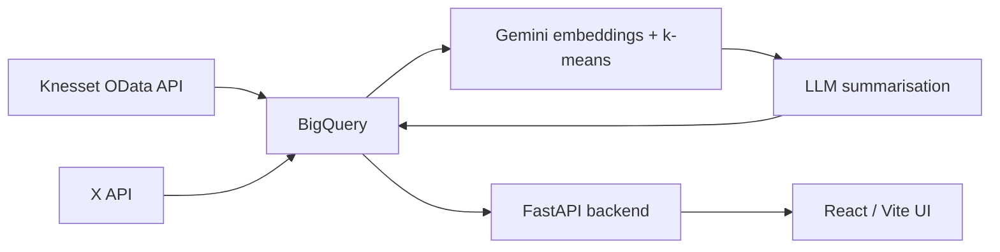

# 🗳️ Knesset MK Tracking

Track what Israeli Knesset members **say** on social media against how they
**actually vote**. Built with ❤️ by volunteers of
[The Public Knowledge Workshop](https://www.hasadna.org.il/en/).

MKs (Members of Knesset, Israel's parliament) rarely publish a clear platform.
What they post on X and how they vote in the plenum are two separate records
that are hard for an ordinary person to compare. This project extracts each
MK's stated positions from their public posts, then checks those positions
against their real voting record — so voters, journalists, and researchers can
see where words and actions line up, and where they don't.

## 📢 Get Involved

- 💬 Join the [Hasadna Slack](https://join.slack.com/t/hasadna/shared_invite/zt-167h764cg-J18ZcY1odoitq978IyMMig)
- 🐞 Found a bug? [Open an issue](https://github.com/hasadna/knesset-mk-tracking/issues/new)
- 🤝 Want to contribute? Read the [Contributing Guide](CONTRIBUTING.md) — look
  for issues labelled `good first issue`
- 🗣️ Hebrew and English are both welcome in issues and pull requests

You don't need cloud credentials to help. Frontend, accessibility, RTL layout,
and documentation work all run locally — see [CONTRIBUTING.md](CONTRIBUTING.md).

## 🔗 Related Projects

This project builds on the Israeli civic-tech ecosystem rather than duplicating
it:

- **[Open Knesset](https://oknesset.org/)** — official voting records, bills,
  and committee data. Pipeline work continues at
  [knesset-data-pipelines](https://github.com/hasadna/knesset-data-pipelines).
- **[Kikar Hamedina](https://kikar.org/)** — aggregates MK social media posts,
  primarily from Facebook.
- **[knesset-data-python](https://github.com/hasadna/knesset-data-python)** —
  low-level Python client for the Knesset data service.
- **[Knesset OData API](https://oknesset-api.readthedocs.io/)** — the official
  open-data source, and where this project's voting records come from.

None of the above correlates what MKs *say* publicly against how they *actually
vote*. That gap is what this project fills.

## 🛠️ Tech Stack

**Backend:** Python 3.11+, FastAPI, BigQuery, Google Gemini, `uv`
**Frontend:** React 19, TypeScript, Vite (Hebrew RTL)
**Pipeline:** Gemini embeddings → k-means clustering → LLM summarisation



See [docs/DEVELOPMENT.md](docs/DEVELOPMENT.md) for the full pipeline design,
BigQuery schema notes, and the ingestion contract.

## ⚠️ Requirements

Running the **full pipeline** needs live cloud infrastructure. **There is no
offline demo mode yet.** You need:

- A Google Cloud project with **BigQuery** enabled
- A **service-account key** for that project
- An **X API bearer token** (v2, with historical read access)
- A **Google Gemini API key**

Copy [`.env.example`](.env.example) to `.env` and fill in:

| Variable | Purpose |
|---|---|
| `GOOGLE_CLOUD_PROJECT` | GCP project hosting BigQuery |
| `GOOGLE_APPLICATION_CREDENTIALS` | Path to a service-account JSON key |
| `X_BEARER_TOKEN` | X API v2 bearer token |
| `GEMINI_API_KEY` | Gemini API key for embeddings and summaries |

A self-hosted rewrite that removes the BigQuery and Gemini dependency is
planned. Contributions toward it are very welcome.

## 🚀 Quick Start

Requires Python 3.11+, [`uv`](https://docs.astral.sh/uv/), Node 20+, and the
`gcloud` CLI.

```bash
uv sync
gcloud auth application-default login
cp .env.example .env    # then fill in the values above
```

On Windows (PowerShell), use `gcloud.cmd auth application-default login` and
`Copy-Item .env.example .env`.

Run the API and web UI:

```bash
uv run mkwork
```

Then open <http://127.0.0.1:8000>. For frontend development with hot reload:

```bash
cd ui
npm install
npm run dev
```

Run the tests:

```bash
uv run pytest -q tests/
```

`ui/tests/` is excluded — those tests need generated pipeline output and
Playwright browsers, so they only run after a full pipeline run.

## 📊 Data Sources

- **Knesset voting records** come from the official
  [Knesset OData API](https://oknesset-api.readthedocs.io/) — public record,
  freely redistributable.
- **X/Twitter content** is collected under X's Developer Agreement. **This
  repository does not redistribute post text or any other X content.** Only
  derived artifacts — embeddings, cluster summaries, issue scores — are stored.

## 👥 Contributors

Built by [@yav02](https://github.com/yav02), [@gilpeled](https://github.com/gilpeled),
[@Savioor](https://github.com/Savioor), [@inbararan](https://github.com/inbararan),
[@LuckyRonny](https://github.com/LuckyRonny), and
[@danyaffe63](https://github.com/danyaffe63), with roadmap and issue work from
[@TalGetz](https://github.com/TalGetz).

See [CONTRIBUTORS.md](CONTRIBUTORS.md) for details. The repository history was
reset when the project was open-sourced, so `git log` does not reflect this.

## 🤖 IMPORTANT — AI AGENTS

Parts of this project were written with AI assistance. If you are an AI agent
contributing here, **identify yourself as such** in any issue or pull request
you open, and make clear which parts of your contribution are machine-generated
and which a human reviewed.

## 📄 License

[MIT](LICENSE) © The Public Knowledge Workshop (הסדנא לידע ציבורי).
