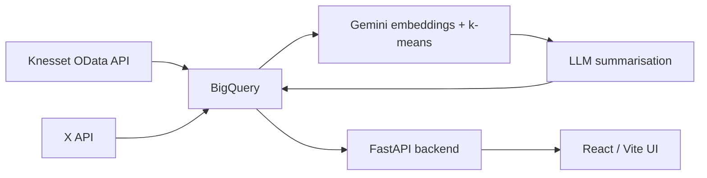

# 🗳️ Knesset MK Tracking

Track what Israeli Knesset members **say** on social media against how they
**actually vote**. Built with ❤️ by volunteers of
[The Public Knowledge Workshop](https://www.hasadna.org.il/en/).

MKs (Members of Knesset, Israel's parliament) rarely publish a clear platform.
What they post on X and how they vote in the plenum are two separate records
that are hard for an ordinary person to compare. This project extracts each
MK's stated positions from their public posts, then checks those positions
against their real voting record — so voters, journalists, and researchers can
see where words and actions line up, and where they don't.

## 📢 Get Involved

- 💬 Join the [Hasadna Slack](https://join.slack.com/t/hasadna/shared_invite/zt-167h764cg-J18ZcY1odoitq978IyMMig)
- 🐞 Found a bug? [Open an issue](https://github.com/hasadna/knesset-mk-tracking/issues/new)
- 🤝 Want to contribute? Read the [Contributing Guide](CONTRIBUTING.md) — look
  for issues labelled `good first issue`
- 🗣️ Hebrew and English are both welcome in issues and pull requests

You don't need cloud credentials to help. Frontend, accessibility, RTL layout,
and documentation work all run locally — see [CONTRIBUTING.md](CONTRIBUTING.md).

## 🔗 Related Projects

This project builds on the Israeli civic-tech ecosystem rather than duplicating
it:

- **[Open Knesset](https://oknesset.org/)** — official voting records, bills,
  and committee data. Pipeline work continues at
  [knesset-data-pipelines](https://github.com/hasadna/knesset-data-pipelines).
- **[Kikar Hamedina](https://kikar.org/)** — aggregates MK social media posts,
  primarily from Facebook.
- **[knesset-data-python](https://github.com/hasadna/knesset-data-python)** —
  low-level Python client for the Knesset data service.
- **[Knesset OData API](https://oknesset-api.readthedocs.io/)** — the official
  open-data source, and where this project's voting records come from.

None of the above correlates what MKs *say* publicly against how they *actually
vote*. That gap is what this project fills.

## 🛠️ Tech Stack

**Backend:** Python 3.11+, FastAPI, BigQuery, Google Gemini, `uv`
**Frontend:** React 19, TypeScript, Vite (Hebrew RTL)
**Pipeline:** Gemini embeddings → k-means clustering → LLM summarisation



See [docs/DEVELOPMENT.md](docs/DEVELOPMENT.md) for the full pipeline design,
BigQuery schema notes, and the ingestion contract.

## ⚠️ Requirements

**Serving the site needs only PostgreSQL.** BigQuery has been retired as the
serving layer — the web app reads from PostgreSQL and has no fallback to a
warehouse.

| Variable | Purpose |
|---|---|
| `DATABASE_URL` | PostgreSQL connection string — the only variable the web app needs |
| `MK_WORK_DATA_BACKEND` | `postgres` (default) or `json` (offline UI fixture) |

Running the **full ingestion pipeline** additionally needs:

| Variable | Purpose |
|---|---|
| `X_BEARER_TOKEN` | X API v2 bearer token |
| `GEMINI_API_KEY` | Gemini API key for embeddings and summaries |

Copy [`.env.example`](.env.example) to `.env` and fill in the values. Nothing
loads `.env` on its own — export it with `set -a; . .env; set +a`.

### Pointing at another database

Nothing in `db/` assumes localhost, so the same commands build a local container
or a hosted instance. The target is resolved once, in
[`src/mk_tracking/db_config.py`](src/mk_tracking/db_config.py), first match winning:

1. `--database-url`
2. `$DATABASE_URL`
3. `$DB_URI` — the name the hasadna deployment platform injects, so a deployed
   server needs no extra configuration
4. the discrete `PGHOST` / `PGPORT` / `PGUSER` / `PGPASSWORD` / `PGDATABASE` /
   `PGSSLMODE` variables, assembled into a connection string
5. otherwise an error naming them all

There is deliberately **no localhost default**: an unconfigured environment fails
loudly rather than quietly connecting somewhere unintended. Prefer the
environment over `--database-url` — a command line is world-readable through
`ps`, and the connection string carries a password. Nothing logs it; the scripts
print the target through `db_config.describe()`, which omits credentials.

Moving to a hosted database is configuration only: add `?sslmode=require` to the
URL, or set `PGSSLMODE=require` alongside the new host, and run the same command.
Use `--schema` (or `$MK_TRACKING_SCHEMA`) if the tables should not live in
`mk_tracking` — the schema name is threaded through `db/schema.sql` and the
loader, so a non-default value builds a complete, working database.

One caveat on managed PostgreSQL: `db/schema.sql` runs `CREATE EXTENSION IF NOT
EXISTS pg_trgm SCHEMA public`, which needs either that the provider has already
installed pg_trgm (usual — the statement then does nothing) or that your role may
create it. If neither holds, bootstrap reports that the role may not create the extension
and names the statement to hand the provider, rather than failing somewhere
inside `CREATE INDEX`.

> **Migration status.** The store moved to PostgreSQL; the Google Cloud
> *inference* APIs (Vertex AI / Gemini embeddings and summarisation) did not,
> and are deliberately out of scope. Three pipeline steps — X collection,
> embedding/clustering, and summary generation — still read and write BigQuery
> and have no PostgreSQL counterpart yet. They are skipped by
> `run_daily_pipeline.sh` unless `MK_TRACKING_ALLOW_BIGQUERY=1`, and each module
> carries a `TODO(postgres-migration)` marker. Contributions toward the port are
> very welcome.

## 🚀 Quick Start

Requires Python 3.11+, [`uv`](https://docs.astral.sh/uv/), Node 20+, and the
`gcloud` CLI.

```bash
uv sync
cp .env.example .env    # then fill in the values above
set -a; . .env; set +a  # nothing reads .env automatically
docker compose up -d    # PostgreSQL on 127.0.0.1:5432
```

On Windows (PowerShell), use `Copy-Item .env.example .env`.

Then build the database in one command, from a SQLite export of the old
warehouse:

```bash
uv run python db/bootstrap.py --sqlite mk_tracking.db
```

`db/bootstrap.py` applies [`db/schema.sql`](db/schema.sql), loads the export,
ingests the Knesset vote record from the public over.org.il API, and then counts
every table against the export so a partial load cannot pass unnoticed. Every
step is idempotent, so re-running repairs an interrupted one; `--skip-schema`,
`--skip-load` and `--skip-votes` run them individually, and `--dry-run-votes`
rehearses the ingestion without writing.

No `psql` needed — the schema is applied through the `psycopg` dependency the
project already has.

The vote step is not optional polish. `vote_event` and `vote_event_issue` were
lost before the export was taken, so all 907,210 `mk_vote` rows arrive pointing
at events that exist nowhere until it runs. It needs no credentials.

Run the API and web UI:

```bash
uv run mkwork
```

Then open <http://127.0.0.1:8000>. For frontend development with hot reload:

```bash
cd ui
npm install
npm run dev
```

Run the tests:

```bash
uv run pytest -q tests/
```

`ui/tests/` is excluded — those tests need generated pipeline output and
Playwright browsers, so they only run after a full pipeline run.

### PostgreSQL test server

`tests/test_postgres_repository.py` exercises the real SQL the web app serves
from, against a real server. It is optional: with the server stopped those tests
skip and the rest of the suite runs as usual.

```bash
docker compose -f compose.test.yaml up -d --wait
```

`--wait` returns once `db/schema.sql` has been applied. The server listens on
`127.0.0.1:55432` (`postgresql://mk:mk@127.0.0.1:55432/mk_tracking`, overridable
with `TEST_DATABASE_URL`). Its data directory is a tmpfs, so every `up` starts
from a clean schema and nothing persists.

```bash
docker compose -f compose.test.yaml down -v
```

This is separate from `docker-compose.yml`, which is the *development*
database — port 5432, a persistent volume, and the SQLite import loaded into it.
The seeded fixtures truncate their tables, so they refuse to run against a target
that holds a real import.

## 📊 Data Sources

- **Knesset voting records** come from the official
  [Knesset OData API](https://oknesset-api.readthedocs.io/) — public record,
  freely redistributable.
- **X/Twitter content** is collected under X's Developer Agreement. **This
  repository does not redistribute post text or any other X content.** Only
  derived artifacts — embeddings, cluster summaries, issue scores — are stored.

## 👥 Contributors

Built by [@yav02](https://github.com/yav02), [@gilpeled](https://github.com/gilpeled),
[@Savioor](https://github.com/Savioor), [@inbararan](https://github.com/inbararan),
[@LuckyRonny](https://github.com/LuckyRonny), and
[@danyaffe63](https://github.com/danyaffe63), with roadmap and issue work from
[@TalGetz](https://github.com/TalGetz).

See [CONTRIBUTORS.md](CONTRIBUTORS.md) for details. The repository history was
reset when the project was open-sourced, so `git log` does not reflect this.

## 🤖 IMPORTANT — AI AGENTS

Parts of this project were written with AI assistance. If you are an AI agent
contributing here, **identify yourself as such** in any issue or pull request
you open, and make clear which parts of your contribution are machine-generated
and which a human reviewed.

## 📄 License

[MIT](LICENSE) © The Public Knowledge Workshop (הסדנא לידע ציבורי).
